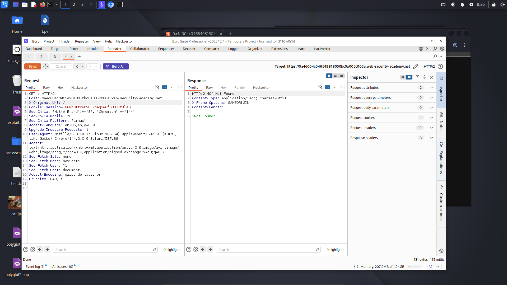
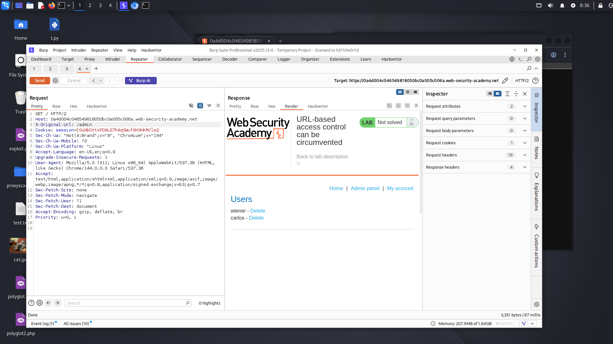
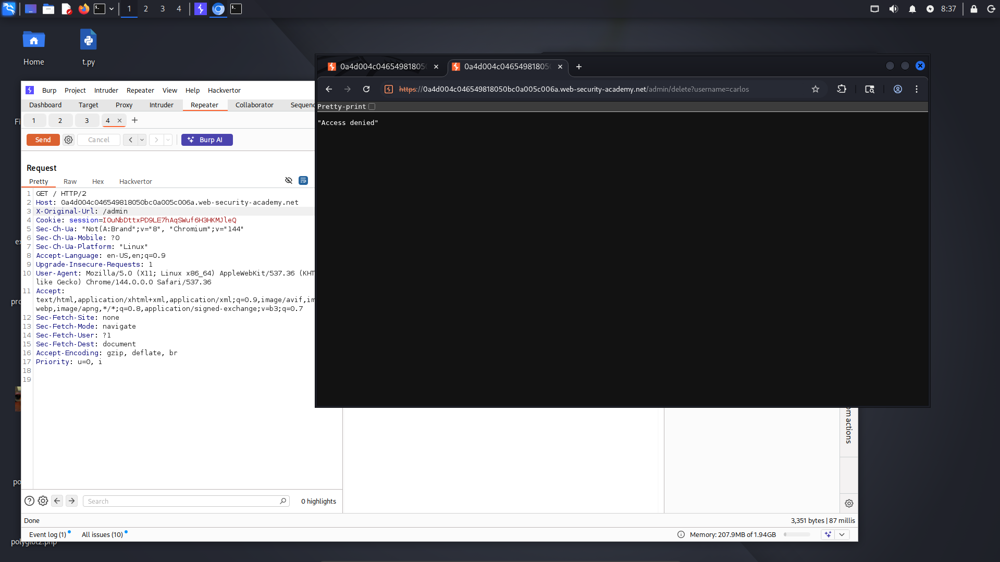
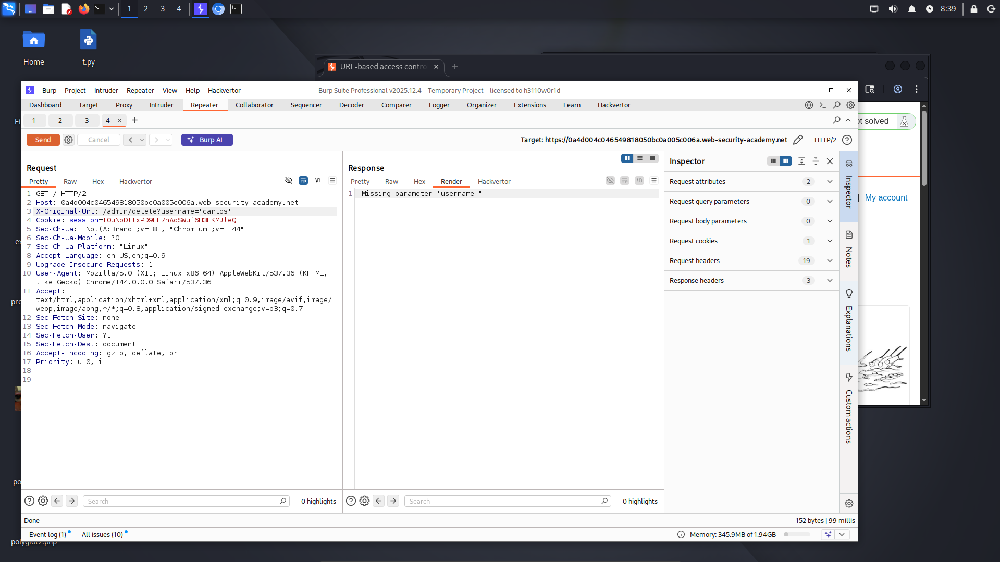
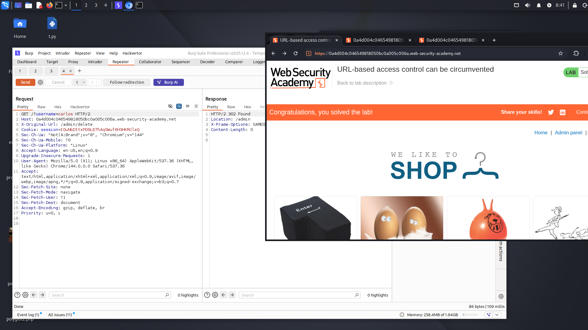

# Lab: URL-based access control can be circumvented

**Difficulty:** PRACTITIONER 
**Category:** Broken Access Control 
**Link:** https://portswigger.net/web-security/access-control/lab-url-based-access-control-can-be-circumvented

## 1. Lab Description

This website has an unauthenticated admin panel at /admin, but a front-end system has been configured to block external access to that path
However, the back-end application is built on a framework that supports the X-Original-URL header

To solve the lab, access the admin panel and delete the user carlos

## 2. Reconnaissance / Initial Analysis

- I started by visiting the main page and reading the lab description. As expected, when I tried to access /admin directly, I got an "Access denied" message

- I remembered that some frameworks respect the X-Original-URL header, so I added it to the request and first tried values like localhost and 127.0.0.1

- It quickly became clear that the header expects a full URL, not just a hostname or IP

- When I sent a random URL, the server responded with "Not Found"

## 3. Exploitation Step-by-Step

1. Next, I changed the URL path to /admin and successfully accessed the Admin Panel

2. Then, I opened this request in the browser using Burp Suite and saw the following:

3. I realized that I needed to modify the request directly in Burp Suite without using a browser. I tried several options, for example:

4. Finally, I thought of putting these parameters in the first line of the headers, and it worked successfully

