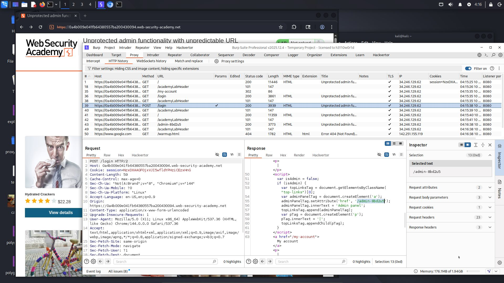
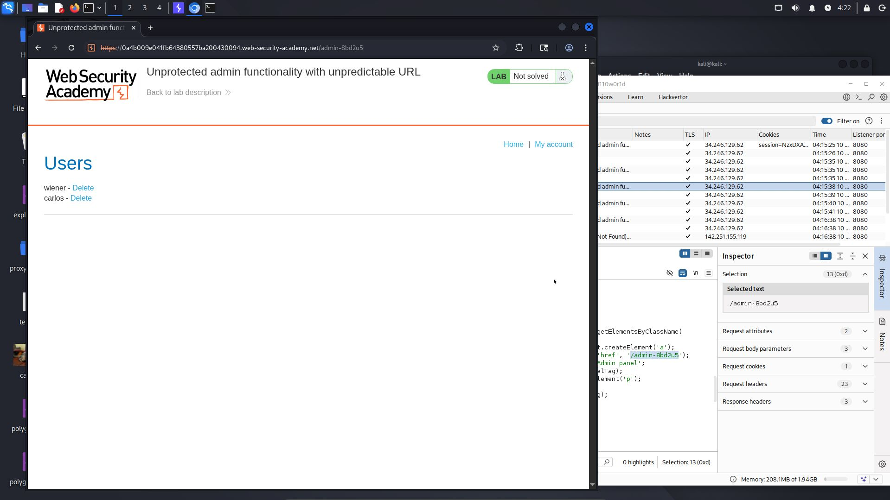
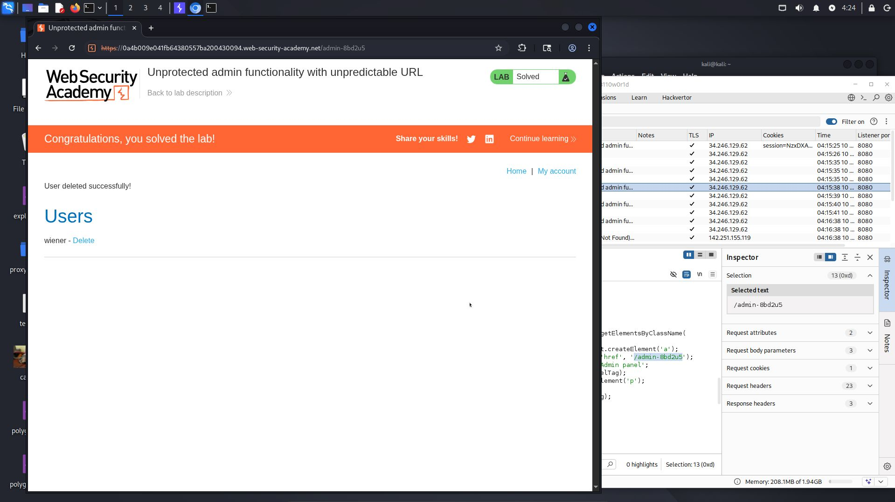

# Lab: Unprotected admin functionality with unpredictable URL

**Difficulty:** Apprentice  
**Category:** Access Control
**Link:** https://portswigger.net/web-security/access-control/lab-unprotected-admin-functionality-with-unpredictable-url

## 1. Lab Description
This lab has an unprotected admin panel. It's located at an unpredictable location, but the location is disclosed somewhere in the application.

Solve the lab by accessing the admin panel, and using it to delete the user carlos

## 2. Reconnaissance / Initial Analysis
- I opened the page and browsed the products, tried logging in, and found nothing. There were no addition buttons or options like PortSwigger usually has. So I searched the HTTP requests history and found an internal /login response with the admin URL

- I saw this:

## 3. Exploitation Step-by-Step
1. After finding admin-8bd2u5, I opened the administrator-panel directory

2. I deleted the user carlos

