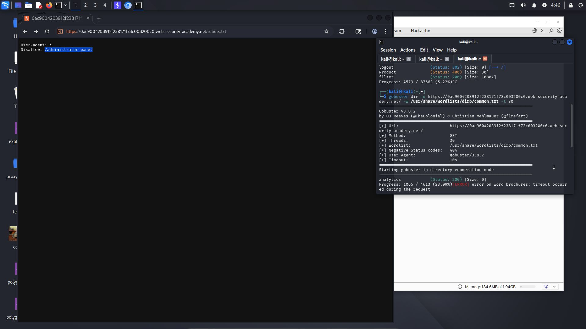
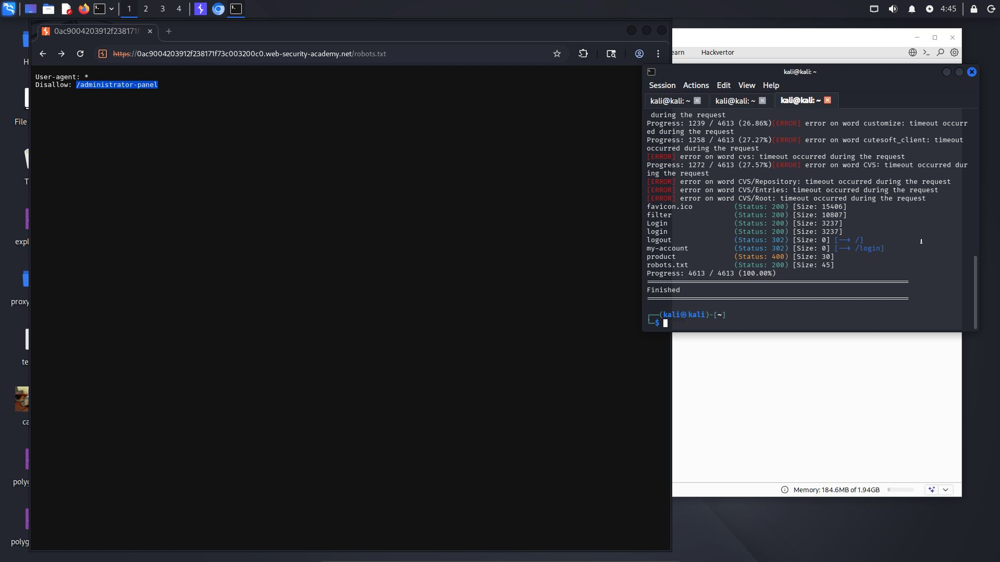
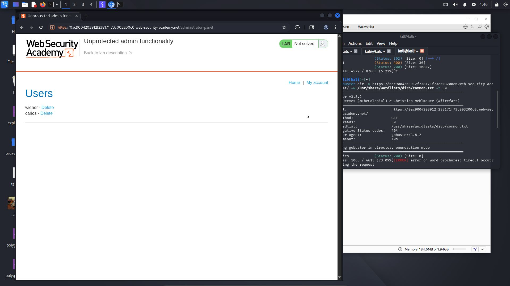
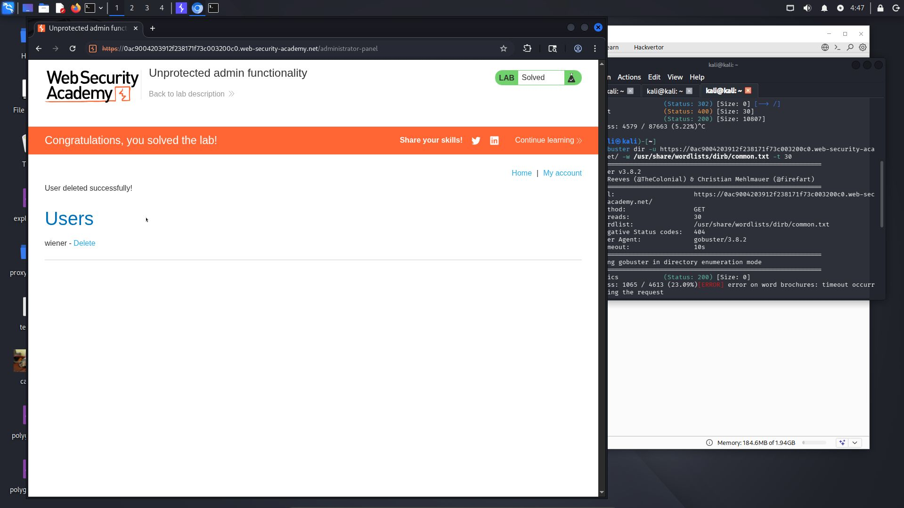

# Lab: Unprotected admin functionality

**Difficulty:** Apprentice  
**Category:** Access Control
**Link:** https://portswigger.net/web-security/access-control/lab-unprotected-admin-functionality

## 1. Lab Description
This lab has an unprotected admin panel. Solve the lab by deleting the user carlos

## 2. Reconnaissance / Initial Analysis
- I opened the page and browsed the products, tried logging in, and found nothing. There were no additional buttons or options like PortSwigger usually has. So I ran dirbuster and found a number of directories. The only interesting one was the robots.txt file, which contained the directory containing the admin panel

- Start command

- Result

## 3. Exploitation Step-by-Step
1. After finding robots.txt, I opened the administrator-panel directory

2. I deleted the user carlos

