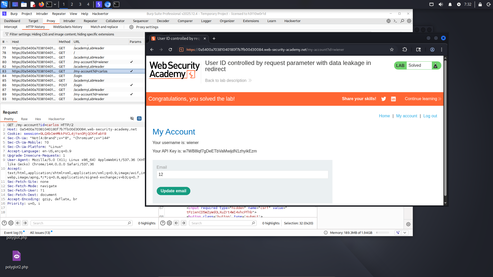
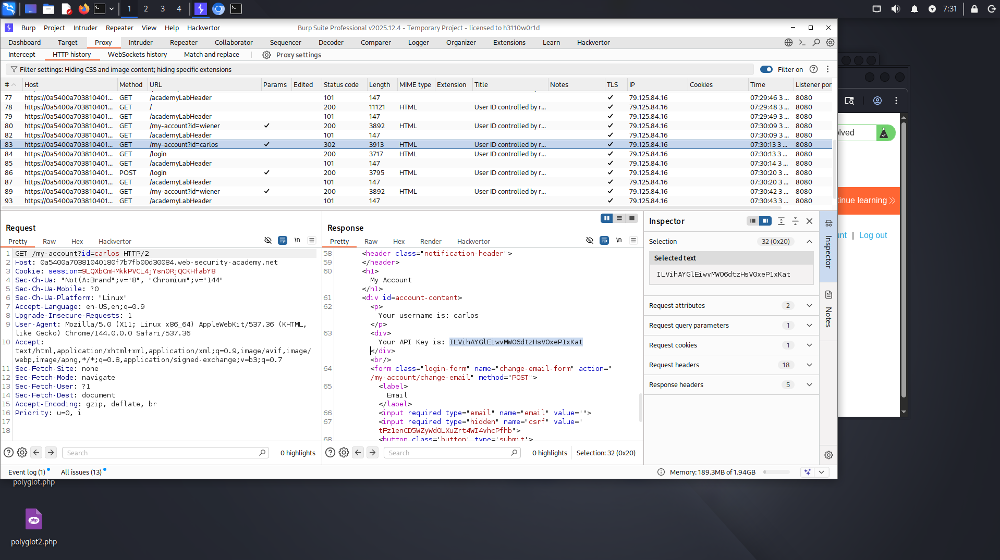

# Lab: User ID controlled by request parameter with data leakage in redirect

**Difficulty:** APPRENTICE 
**Category:** Broken Access Control 
**Link:** https://portswigger.net/web-security/access-control/lab-user-id-controlled-by-request-parameter-with-data-leakage-in-redirect

## 1. Lab Description

This lab contains an access control vulnerability where sensitive information is leaked in the body of a redirect response

To solve the lab, obtain the API key for the user carlos and submit it as the solution

You can log in to your own account using the following credentials: wiener:peter

## 2. Reconnaissance / Initial Analysis

- I opened the page and started analyzing it. After reading the lab description, I logged in to my account. Then, I noticed my API key on the page
- Next, I tried to open other pages on the website because I needed gather more information
- Then, I noticed the "id" parameter in the URL

## 3. Exploitation Step-by-Step

1. I changed the "id" parameter in the URL

2. I saw carlos's API key and successfully solved the lab

