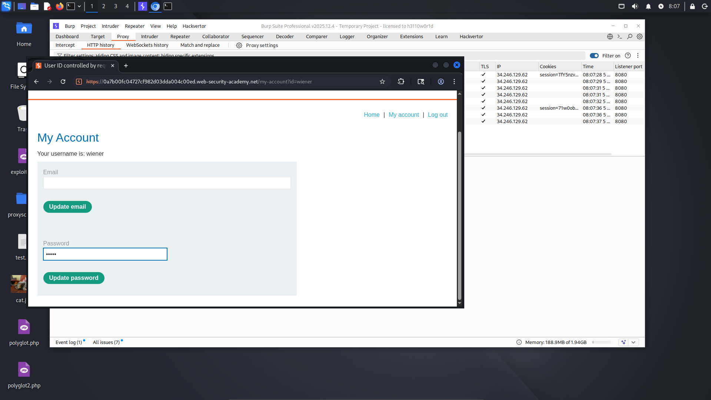
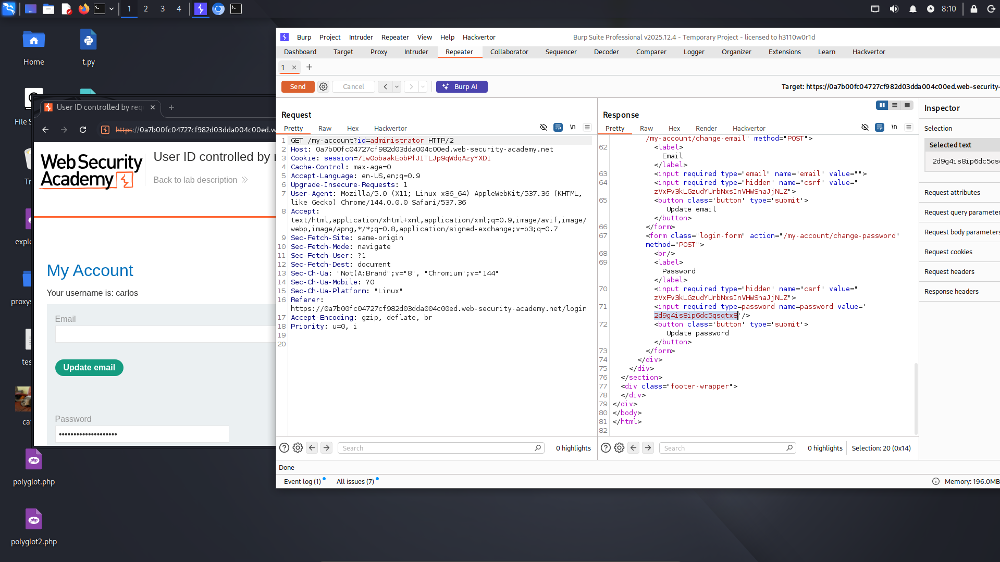
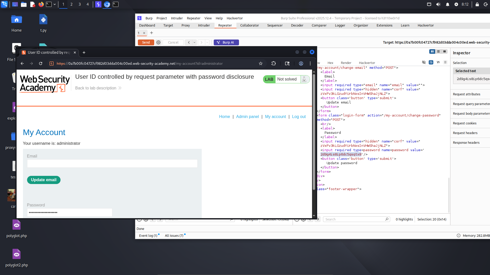
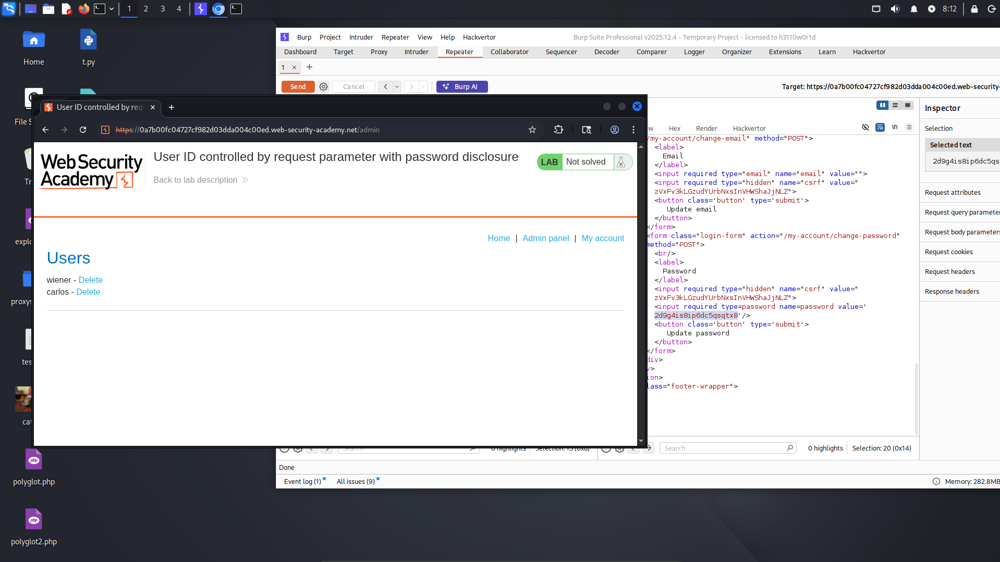
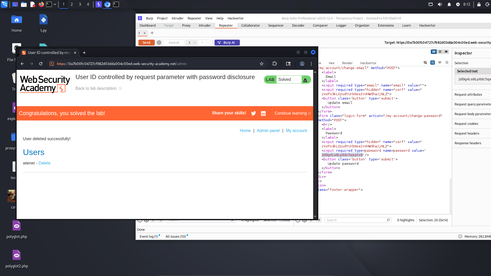

# Lab: User ID controlled by request parameter with password disclosure

**Difficulty:** APPRENTICE 
**Category:** Broken Access Control 
**Link:** https://portswigger.net/web-security/access-control/lab-user-id-controlled-by-request-parameter-with-password-disclosure

## 1. Lab Description

This lab has user account page that contains the current user's existing password, prefilled in a masked input

To solve the lab, retrieve the administrator's password, then use it to delete the user carlos

You can log in to your own account using the following credentials: wiener:peter

## 2. Reconnaissance / Initial Analysis

- I opened the page and started analyzing it. After reading the lab description, I logged in to my account

- Then, I noticed an input field that contained my password

## 3. Exploitation Step-by-Step

1. I decided to change the "id" parameter in the URL to carlos, and I noticed his password on the page:

2. Next, I changed the "id" parameter from carlos to administrator and successfully retrieved the administrator's password

3. Then, I logged in to the administrator account and noticed the Admin Panel button

4. I clicked on the Admin Panel button and accessed the admin page:

5. Finally, I clicked "delete" on the user carlos and successfully solved the lab

