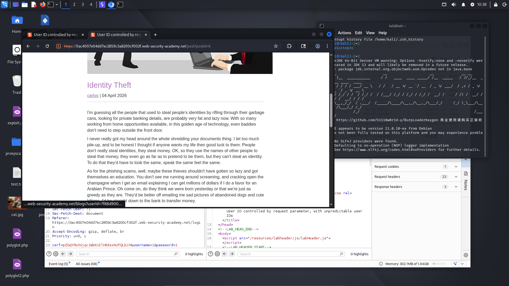
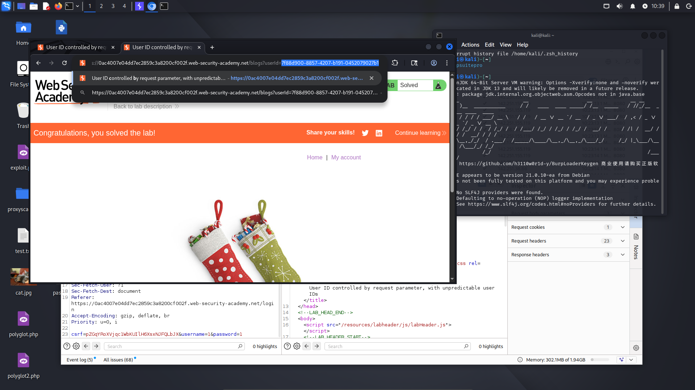
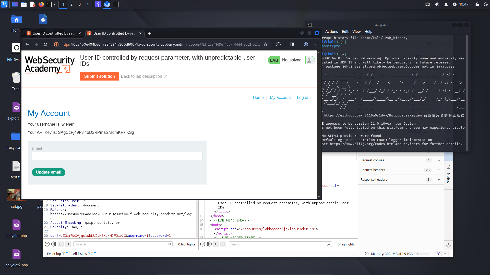
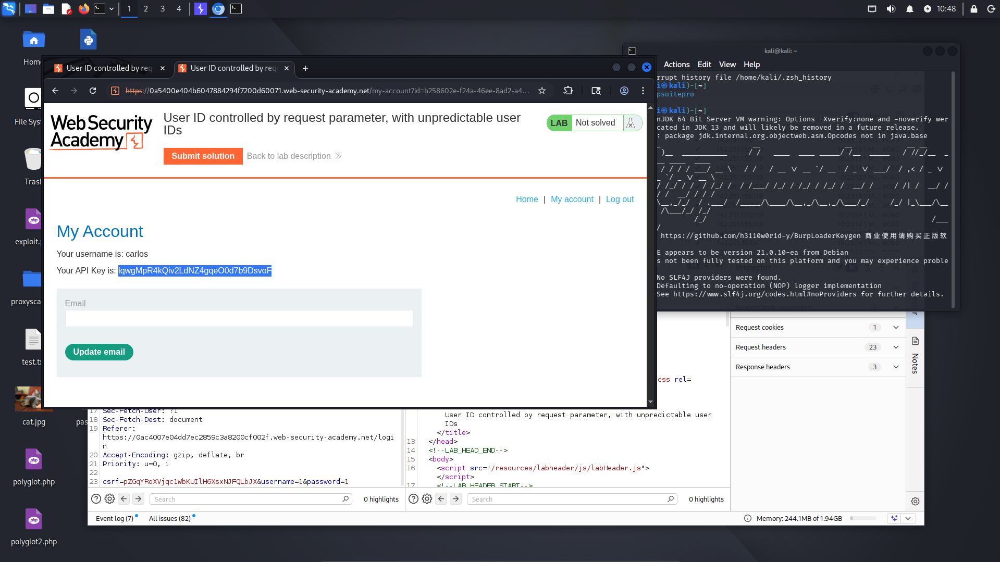
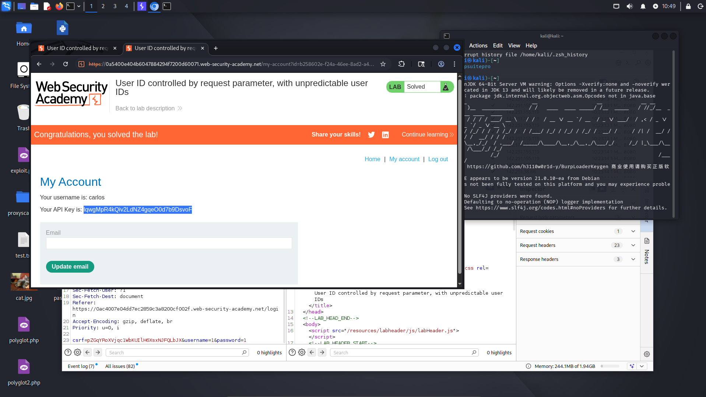

# Lab: User ID controlled by request parameter with unpredictable user IDS

**Difficulty:** APPRENTICE 
**Category:** Broken Access Control 
**Link:** https://portswigger.net/web-security/access-control/lab-user-id-controlled-by-request-parameter-with-unpredictable-user-ids

## 1. Lab Description

This lab has a horizontal privilege escalation vulnerability on the user account page, but identifies users with GUIDs

To solve the lab, find the GUID for carlos, then submit his API key as the solution

You can log in to your own account using the following credentials: wiener:peter

## 2. Reconnaissance / Initial Analysis

- I opened the page and analyzed it. After reading the lab description, I logged in to my account. Then, I noticed my GUID in the URL
- I intercepted the request in Burp Suite and analyzed it. I tried changing the username and modifying different parameters, but it was not successful
- Finally, I decided to analyze the entire page and found a post created by Carlos. I noticed his GUID in the URL

## 3. Exploitation Step-by-Step

1. I logged in to my account:

2. I changed the URL parameter to carlos's GUID and I retrieved his API key:

3. I submitted his API key and received a success message:

