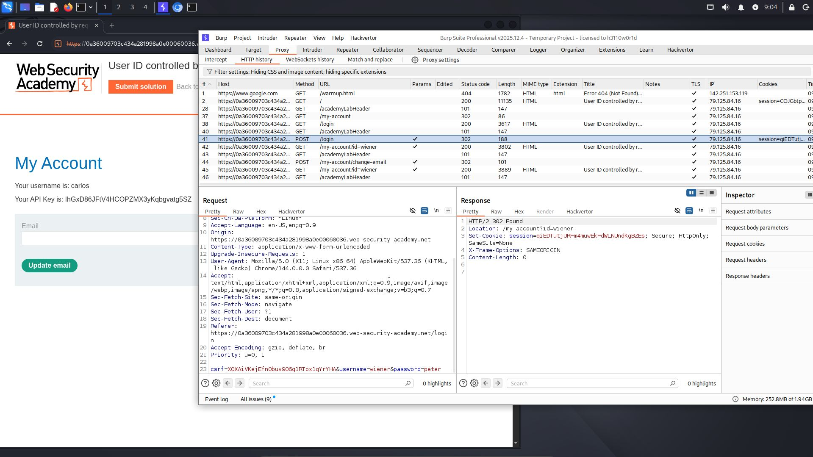
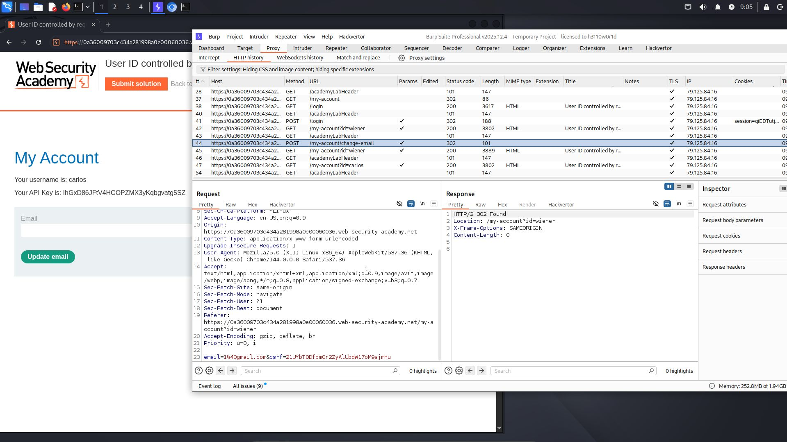
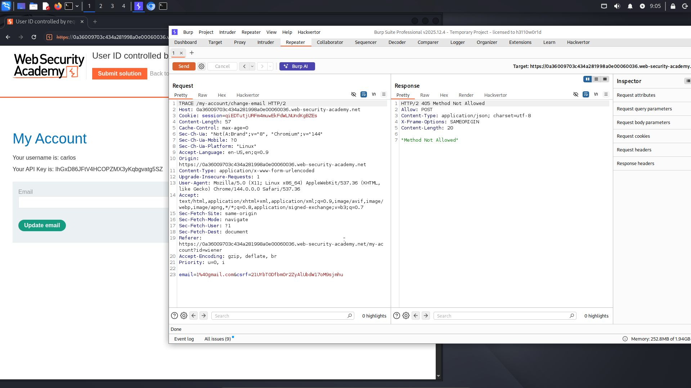
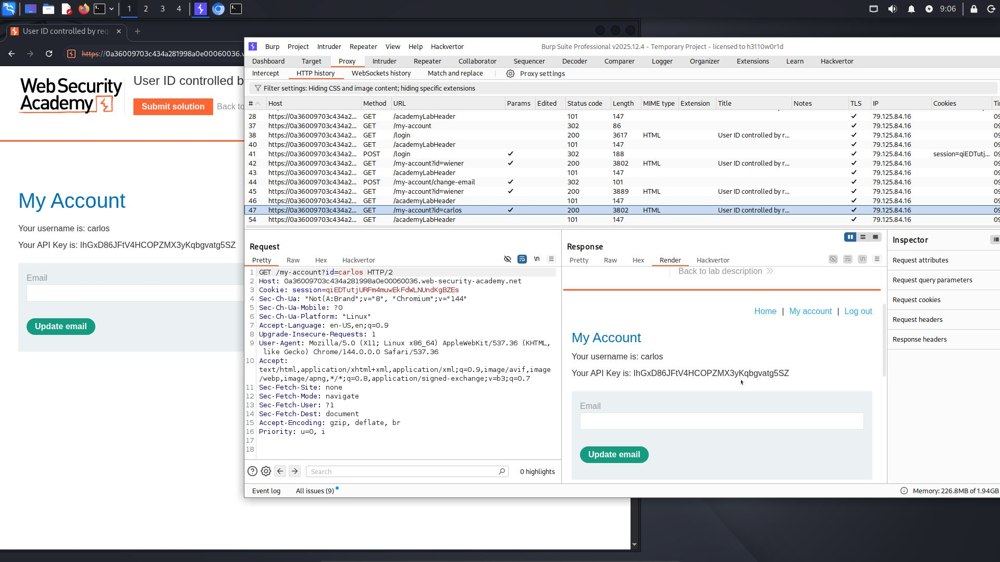
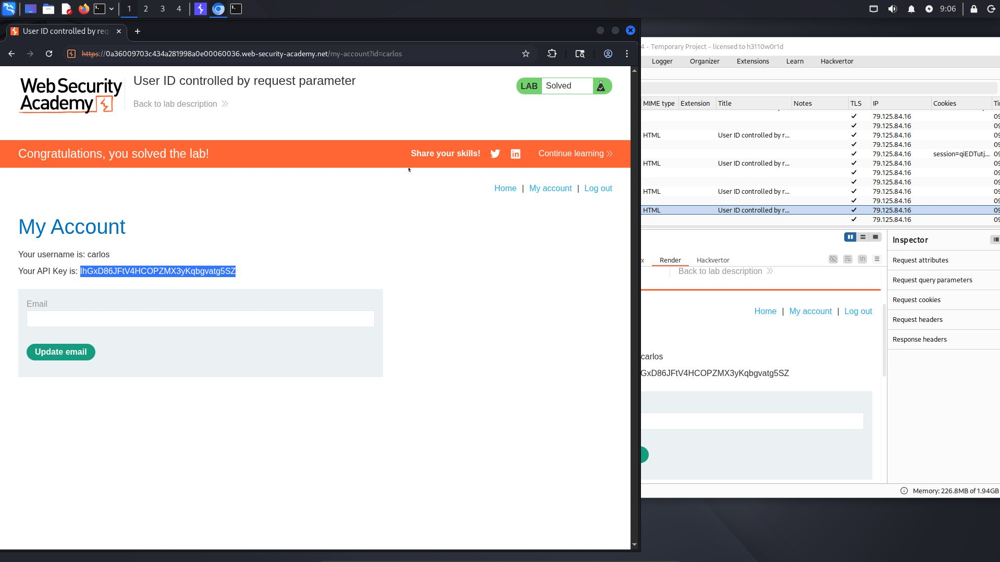

# Lab: User ID controlled by request parameter

**Difficulty:** Apprentice 
**Category:** Broken Access Control 
**Link:** https://portswigger.net/web-security/access-control/lab-user-id-controlled-by-request-parameter

## 1. Lab Description

This lab has a horizontal privilege escalation vulnerability on the user account page

To solve the lab, obtain the API key for the user carlos and submit it as the solution

You can log in to your own account using the following credentials: wiener:peter

## 2. Reconnaissance / Initial Analysis

- I opened the page and researched it. I read the lab description and analyzed the requests in Burp Suite. I logged in to the page, but I found nothing that could contain the API key

- I decided to try changing the email, but I didn’t find the API key in the response

- Then I tried changing the request method from POST to TRACE and GET, and I saw: "METHOD NOT ALLOWED"

## 3. Exploitation Step-by-Step

3. Then I decided to analyze the requests again, and I tried changing the "id" parameter in the URL request, and I saw that the API key had changed

4. Then I copied this API key and submitted it in the "Submit Solution" field, and solved the lab

