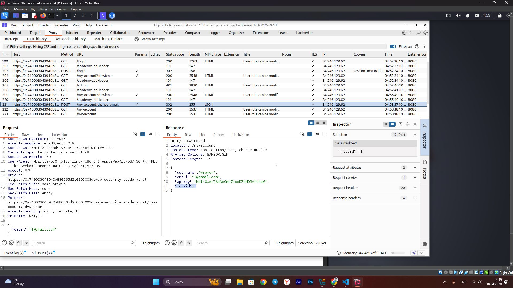
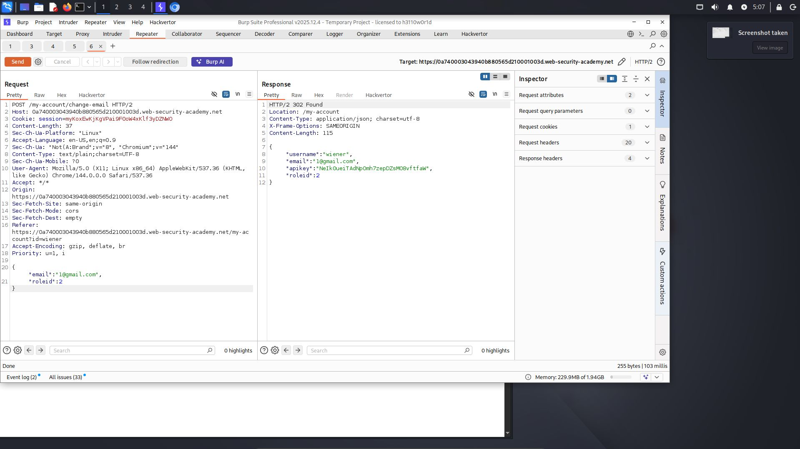
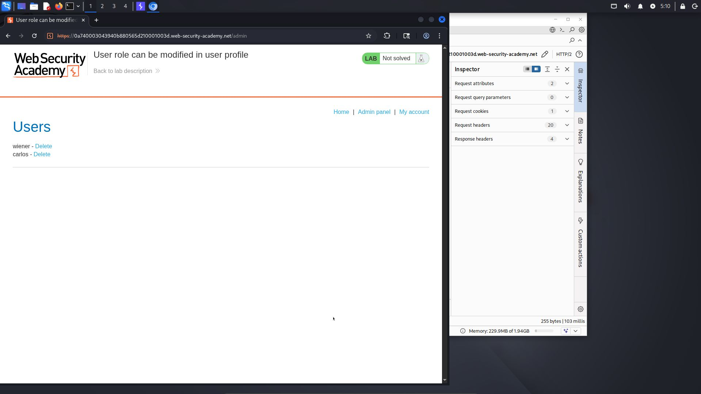
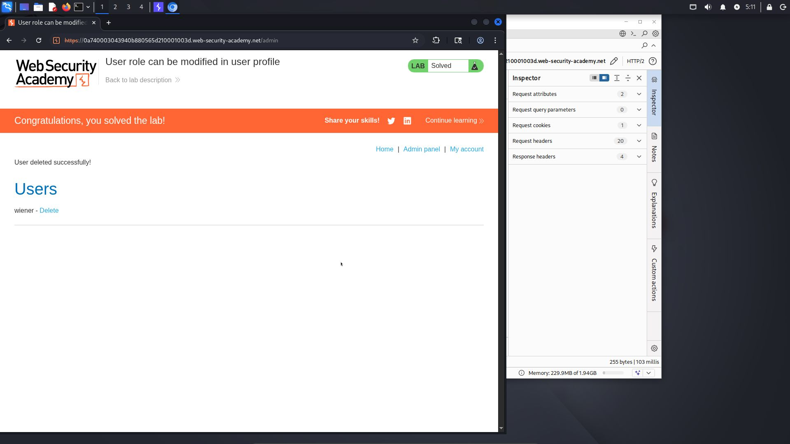

# Lab: User role can be modified in user profile

**Difficulty:** Apprentice
**Category:** Access Control
**Link:** https://portswigger.net/web-security/access-control/lab-user-role-can-be-modified-in-user-profile

## 1. Lab Description

This lab has an admin panel at /admin. It is only accessible to logged-in users with a roleid of 2

Solve the lab by accessing the admin panel and using it to delete the user Carlos

You can log in to your own account using the following credentials: wiener:peter

## 2. Reconnaissance / Initial Analysis

- I opened the login page and logged in as wiener:peter. Then I tried to access the /admin page and saw the message: "Admin interface only available if logged in as an administrator"

- Then I inspected the requests in Burp Suite but did not find anything useful. So, I decided to change the email address because it was the only functionality I could interact with

- I changed the email address and checked the requests in Burp Suite. Then I noticed the "roleid" parameter in the response:

## 3. Exploitation Step-by-Step

1. I decided to try sending the "roleid" parameter in the next request. I sent the POST request to Repeater and included the "roleid" parameter along with the email. After sending the request, I saw that the "roleid" parameter was successfully updated in the response

2. Then I opened the /admin page in the browser and successfully accessed the admin panel:

3. I clicked "Delete" next to the user Carlos and completed the lab

