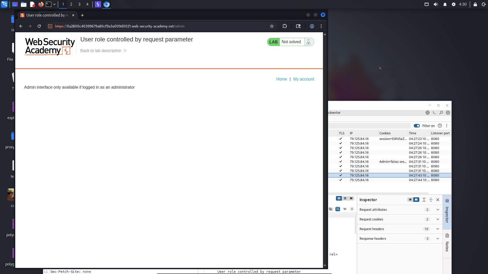
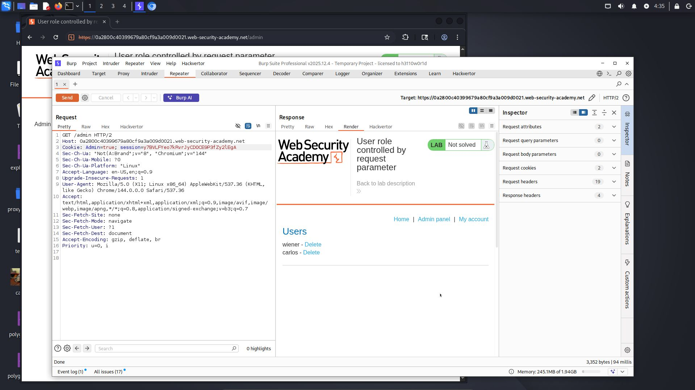
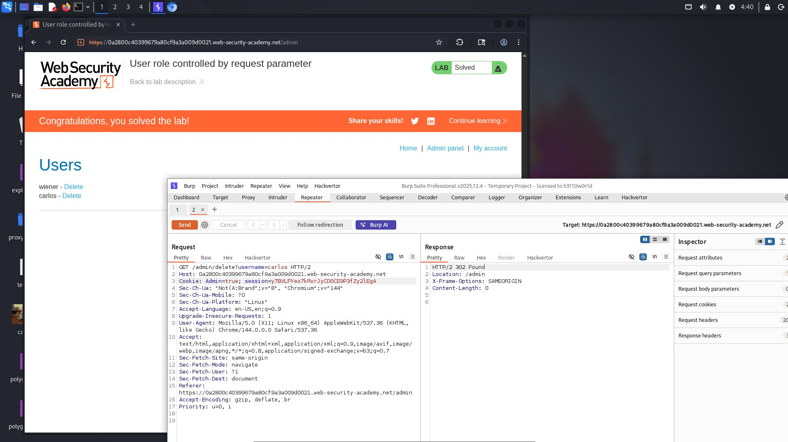

# Lab: User role controlled by request parameter

**Difficulty:** Apprentice 
**Category:** Access Control 
**Link:** https://portswigger.net/web-security/access-control/lab-user-role-controlled-by-request-parameter

## 1. Lab Description
This lab has an admin panel at /admin, which identifies administrators using a forgeable cookie

Solve the lab by accessing the admin panel and using it to delete the user Carlos

You can log in to your own account using the following credentials: wiener:peter

## 2. Reconnaissance / Initial Analysis
- I opened the login page and logged in as wiener:peter. Then I tried to access the /admin page and saw the message: "Admin interface only available if logged in as an administrator

- Then I inspected the requests in Burp Suite and found a cookie parameter called "Admin=false". It looked like a potential attack vector, so I decided to modify it

- I saw this:

## 3. Exploitation Step-by-Step
1. After finding the cookie parameter, I sent the request to Repeater and changed "false" to "true". Then I successfully accessed the admin panel

2. I right-clicked the request and selected "Open response in browser". Then I clicked "Delete" on the user Carlos, but it did not work because I did not have the modified cookie in my browser session

3. So I intercepted the request "/admin/delete?username=carlos" in Burp Suite and sent it to Repeater. Then I changed the parameter "Admin=false" to "Admin=true" and sent the request. I received a successful response and completed the lab.

