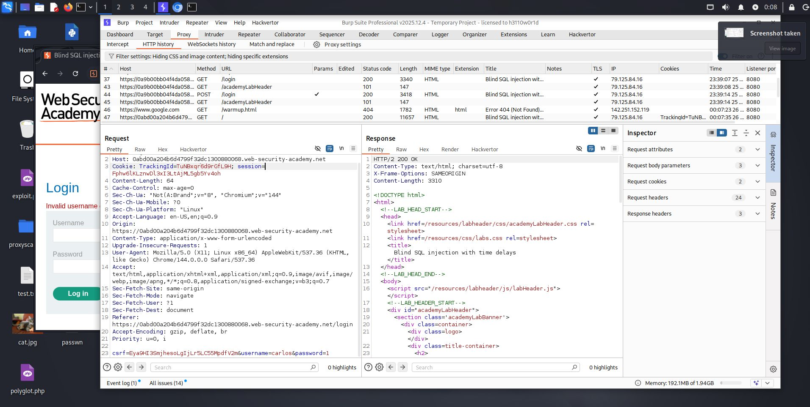
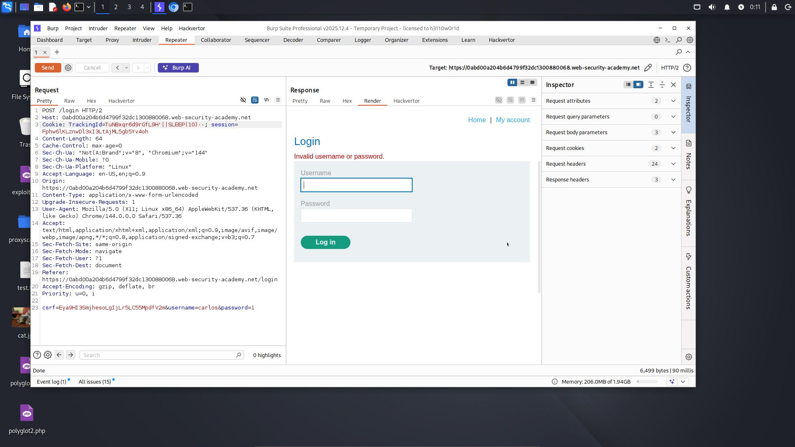
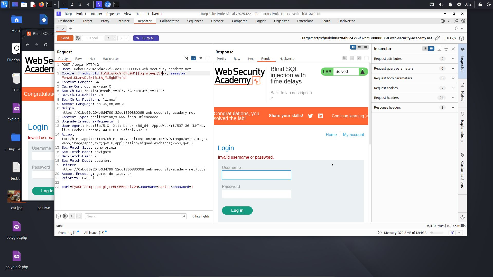

# Lab: Blind SQL injection with time delays

**Difficulty:** Practitioner 
**Category:** SQL Injection 
**Link:** https://portswigger.net/web-security/sql-injection/blind/lab-time-delays

## 1. Lab Description

This lab contains a blind SQL injection vulnerability. The application uses a tracking cookie for analytics, and performs a SQL query containing the value of the submitted cookie

The results of the SQL query are not returned, and the application does not respond any differently based on whether the query returns any rows or causes an error. However, since the query is executed synchronously, it is possible to trigger conditional time delays to infer information

To solve the lab, exploit the SQL injection vulnerability to cause a 10 second delay

## 2. Reconnaissance / Initial Analysis

- I opened the page and analyzed it. I read the lab description and looked for the "trackingId" parameter. Then I started testing this parameter 

## 3. Exploitation Step-by-Step

1. I decided to try sending different payloads, for example "SLEEP(10)" and observed the response:

2. Then I tried "pg_sleep(5)" and successfully completed the lab:

