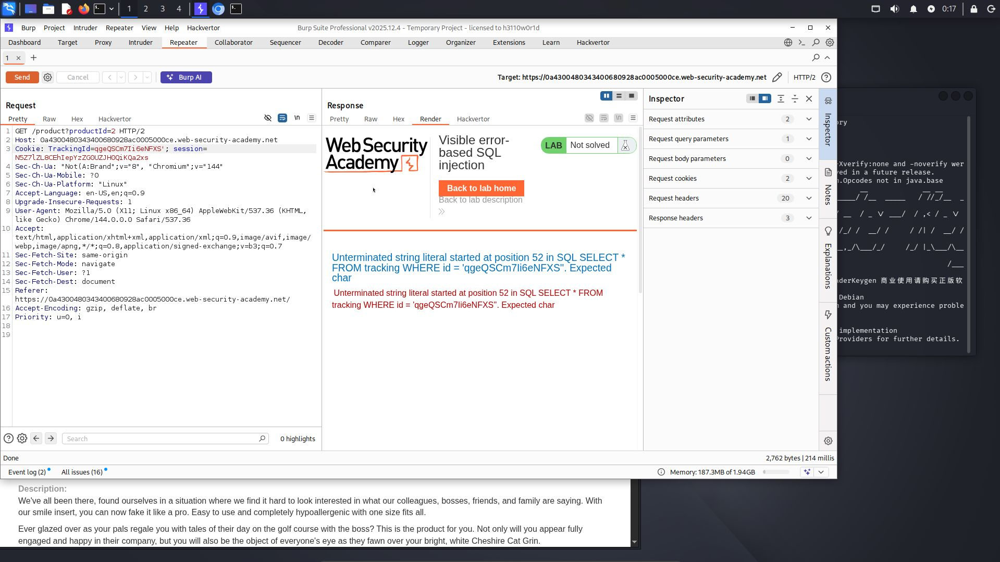
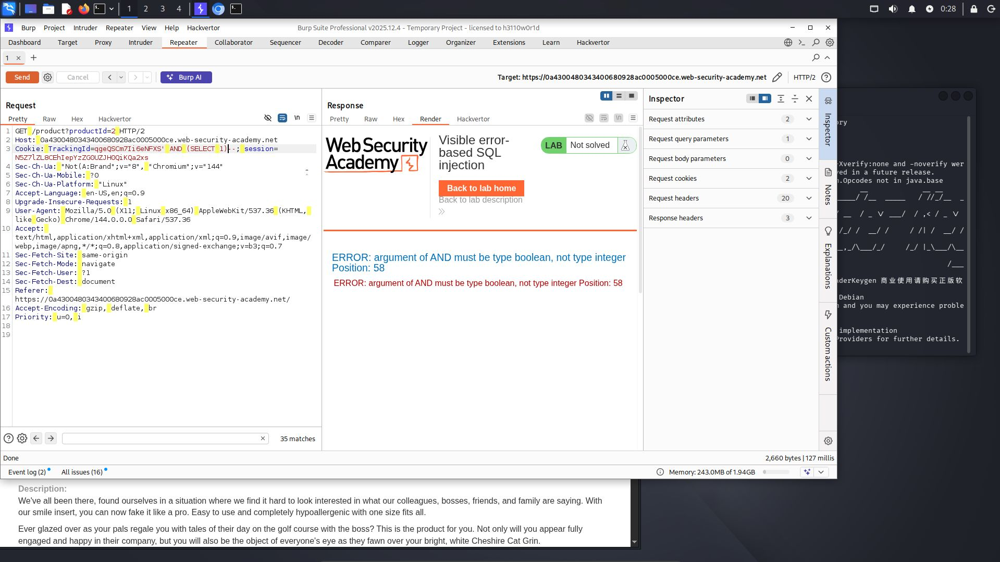
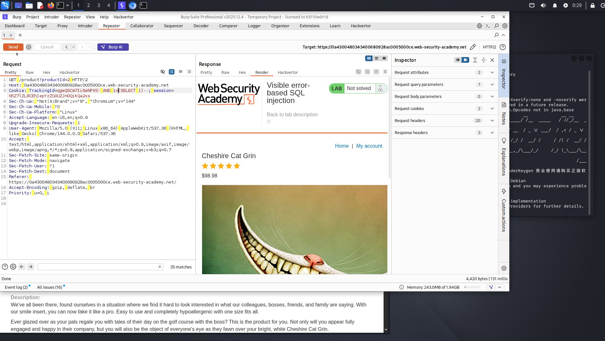
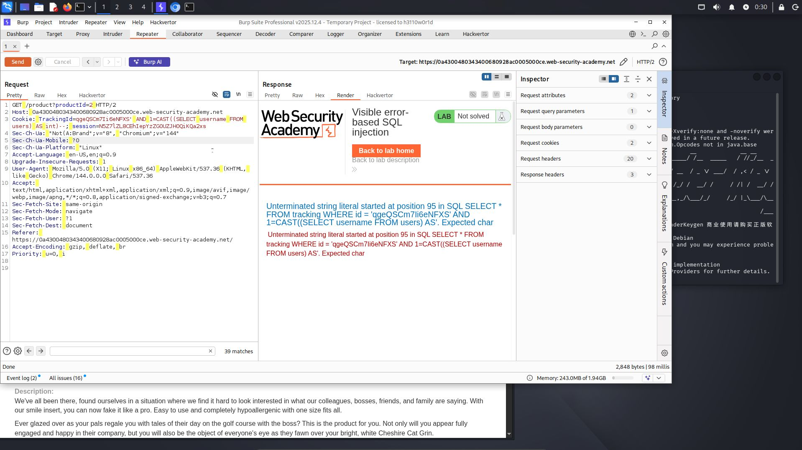
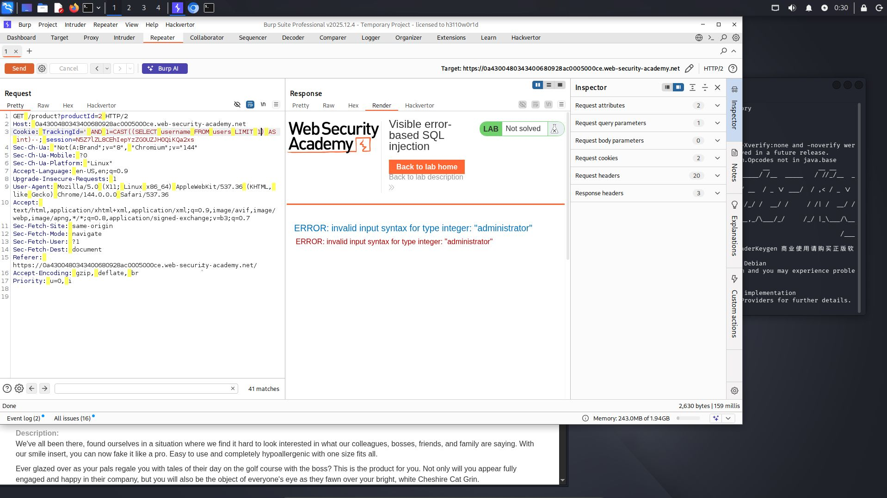
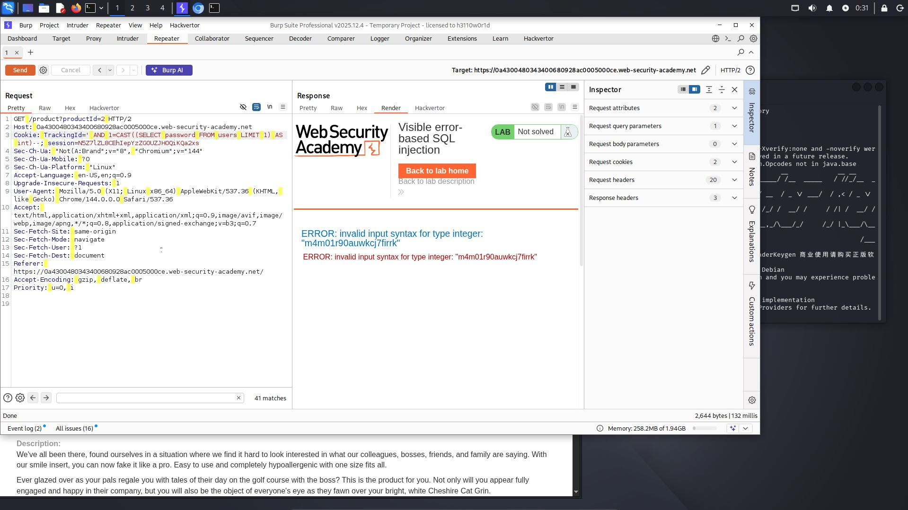
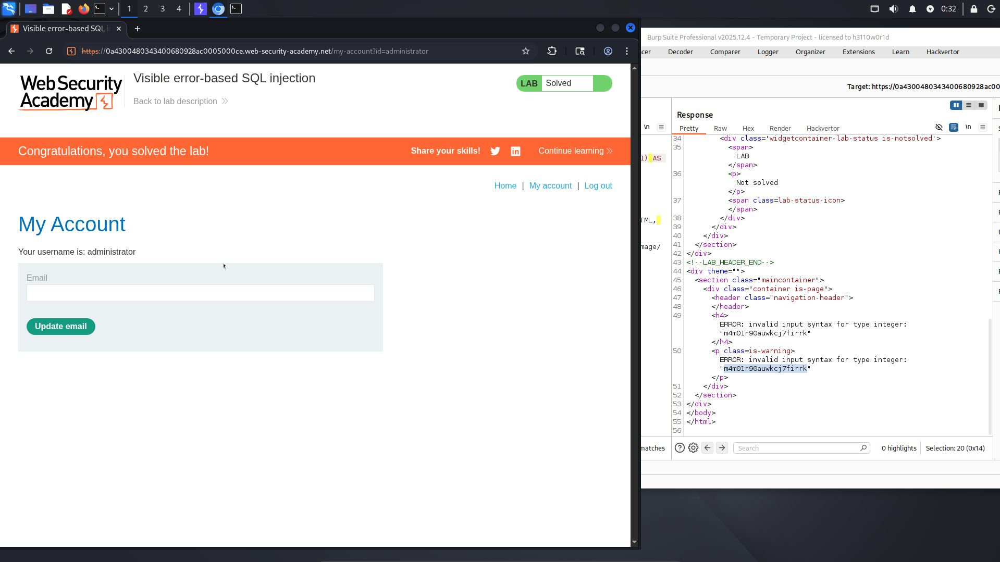

# Lab: Visible error-based SQL injection

**Difficulty:** Practitioner
**Category:** SQL Injection
**Link:** https://portswigger.net/web-security/sql-injection/blind/lab-sql-injection-visible-error-based

## 1. Lab Description

This lab contains a SQL injection vulnerability. The application uses a tracking cookie for analytics, and performs a SQL query containing the value of the submitted cookie. The results of the SQL query are not returned

The database contains a different table called users, with columns called username and password. To solve the lab, find a way to leak the password for the administrator user, then log in to their account

## 2. Reconnaissance / Initial Analysis

- I opened the page and researched it. I read the lab description and searched for the parameter "trackId". Then I pasted "'", and I understood that the lab has an SQL injection vulnerability

## 3. Exploitation Step-by-Step

1. I decided to try sending "AND (SELECT 1)" and saw this:

2. Then I decided to convert it to a boolean expression using 1=(SELECT 1)

3. I decided to add CAST, and I got the username and password fields and the table name from the lab description. I received an error because there were too many characters

4. I fixed it by deleting the cookie (MySQL error messages are limited to 32 characters)

5. Then I fixed it using LIMIT 1

6. I got the password by changing the field from username to password

7. Then I sent these credentials to the login page and logged in

